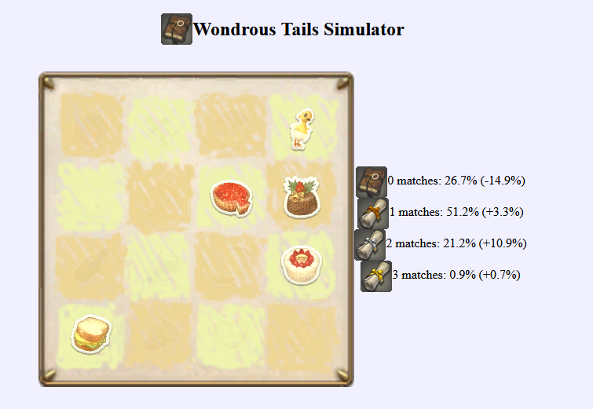

# Wondrous Tails Simulator



A simulator to calculate the odds of getting good matches in FF 14's [Wondrous Tails](https://ffxiv.consolegameswiki.com/wiki/Wondrous_Tails). 
These stats update as you mark your sticks, and show if you're better off committing to your board or shuffling.

This is similar to [Ashtender's excellent sim](http://ashtender.com/ffxiv/tails), please go check theirs out!

## Building
This project is launched using [trunk](https://trunkrs.dev/):

```sh
trunk serve static/index.html --watch .
```
This will launch a server on http://localhost:8080 with the webpage, and update with any changes.

See the documentation for Trunk for any deviations from this that you wish.

## Contributing

Feel free to point out bugs and suggest improvements! Please open an Issue or PR on Github any time.

## License

The simulator itself is licensed under the MIT License.
The "Wondrous Tails" minigame and assets, as well as Final Fantasy 14, are copyright of Square Enix.